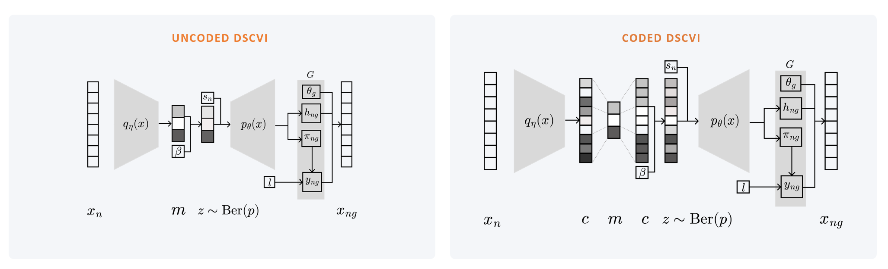
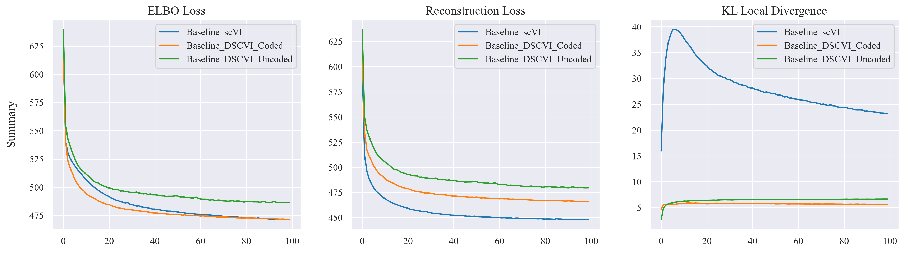
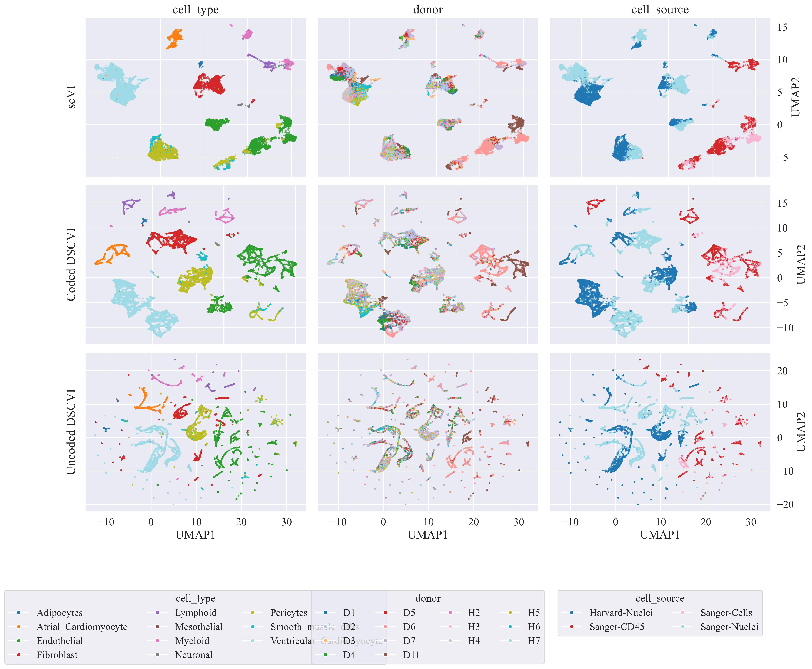
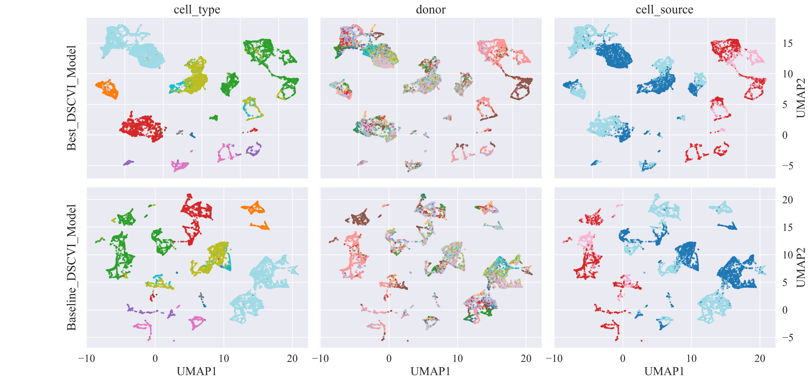

# Discrete Latent Models for Single-Cell RNA-seq

Code for implementation of Bachelor's thesis (Trabajo de Fin de Grado) in Data Science and
Engineering at the Universidad Carlos III de Madrid (UC3M).

- **Author:** Enica King Chiong
- **Advisor:** Pablo Martínez Olmos
- **Year:** [2026]
- **Thesis:** Available on UC3M e-Archivo to members of the community.

## Overview

Variational autoencoders for single-cell RNA sequencing, such as
[scVI](https://scvi-tools.org/), normally use a continuous latent space. This
project provides a proof-of-concept of a **discrete latent representation** for 
scVI, including a variant based on an **error-correcting code (ECC) scheme** developed
by [Martínez-García et al in 2025](https://proceedings.mlr.press/v286/martinez-garcia25a.html), and compares them with the standard continuous scVI baseline.



The experiments look at:

- reconstruction quality against the continuous baseline;
- the structure of the learned latent spaces;
- the effect of model and training hyperparameters.

### Main results

<!-- Replace with 2-4 concrete findings, ideally with one figure or table. -->

- DSCVI models converge stably and at similar levels as the baseline scVI. The ECC model reaches 462.9 ELBO versus 465.0 for scVI on Atlas Cell Heart v1 dataset.



- Coded DSCVI model with ECC mechanism effectively improves global structure



- Gridsearch reveals a tradeoff between latent space interpretability and reconstruction ability, and several overfitting patterns when not using cyclical KL annealing. 

- Best model for 10 information bits and 5 code rate trained at 2 cycles with 35 epochs per cycle and 10 reparametrization beta.




| Model         | MIE    | MIEM  | MP   | RE      | ELBO  | ZFCE   | IBV   | ISS   | ENT  | COV    |
| ------------- | ------ | ----- | ----- | ------- | ----- | ------ | ----- | ----- | ---- | ------ |
| Uncoded DSCVI | 11.57  | 5.99  | 0.65  | 470.0   | 476.7 | 0.7721 | 0.09  | 5.05  | 5.07 | 17.48% |
| Coded DSCVI   | 15.03  | 7.09  | 0.60  | 457.8   | 462.9 | 0.7655 | 0.11  | 4.49  | 6.78 | 42.09% |
| Best Model    | 13.362 | 6.860 | 0.673 | 463.674 | 465.8 | 0.771  | 0.109 | 4.463 | 7.10 | 24.2%  |


<!-- Remove the image line above if you don't add a figure. -->

## Repository structure

| Path | Description |
| --- | --- |
| `dscvi.ipynb` | Main notebook: model implementation, training, and experiments. |
| `requirements.txt` | Python dependencies. |
| `scvi_data/` | Default output location for downloaded data, checkpoints and plots (untracked by git). |
| `figures/` | Auxiliary figures for README file. |

This is a research repository, not an installable package. The notebook is the entry point.

## Getting started

### Requirements

- Python 3.10+
- [scvi-tools](https://scvi-tools.org/) 1.4.2. The code relies on some scvi-tools
  internals, so other versions may break it.
- A GPU is optional but recommended for training. For model training and gridsearch in this work, an NVIDIA RTX 4060 GPU was used.

### Installation

```bash
git clone https://github.com/enicaking/tfg-vae.git
cd tfg-vae

python -m venv .venv
source .venv/bin/activate        # Windows PowerShell: .venv\Scripts\Activate.ps1

python -m pip install --upgrade pip
python -m pip install -r requirements.txt
```

For a CUDA-enabled PyTorch build, install PyTorch first following the
[official selector](https://pytorch.org/get-started/locally/), then run the
`pip install -r requirements.txt` step above.

### Running the experiments

```bash
jupyter lab
```

Open `dscvi.ipynb` and run the cells in order. The notebook downloads the
dataset(s) automatically, trains the models, and writes outputs to `scvi_data/`.

<!-- Expected cost: [approximate disk space, RAM, and training time on your hardware]. -->

## Data

The dataset involved in this work is the Atlas Cell Heart v1 dataset, accessible at `scvi.data.heart_cell_atlas_subsampled()`. Top 2,000 highly variable genes (HVGs) under seurat processing are retained. Final dataset is 18,641 cells x 2,000 genes.

Data and trained models are not included in this repository. Running the
notebook reproduces them. Training is carried out with `scvi.settings.seed = 0`.

## Citation

If you use this code, please cite the thesis:

```bibtex
@thesis{dscvi,
  author  = {Enica King},
  title   = {Variational Inference in Single-Cell Transcriptomics},
  school  = {Universidad Carlos III de Madrid},
  type    = {Bachelor's thesis},
  year    = {2026},
  url     = {https://github.com/enicaking/tfg-vae}
}
```

## Acknowledgements

Built on [scvi-tools](https://scvi-tools.org/) (Gayoso et al., 2022) and [dvae-ecc](https://proceedings.mlr.press/v286/martinez-garcia25a.html) I would like to extend my thanks to
Pablo Martínez Olmos for his guidance during this project.

## License

Released under the [MIT License](LICENSE). <!-- Add a LICENSE file, or change this line. -->
